 # Задание 1
 ## Создадим   personal.auto.tfvars


```
# personal.auto.tfvars
cloud_id                 = "ваш_cloud_id"
folder_id                = "ваша_folder_id"
service_account_key_file = "key.json" # Путь к файлу ключа сервисного аккаунта
vms_ssh_public_root_key  = "ваш_публичный_ssh_ключ"
```


```
terraform init
```

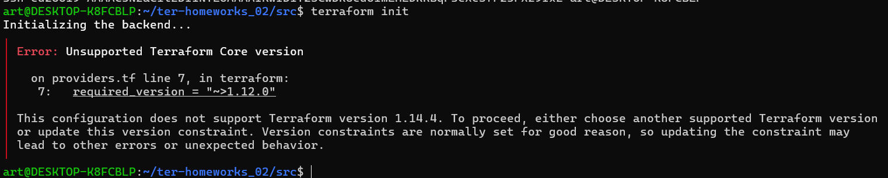

Поправим
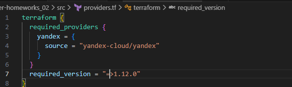


Добавим блок для подключения по ssh
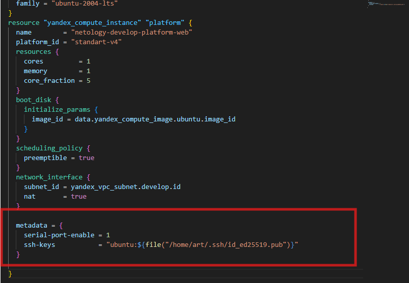


```
terraform plan

```
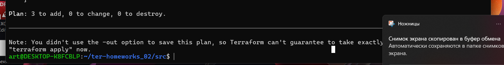


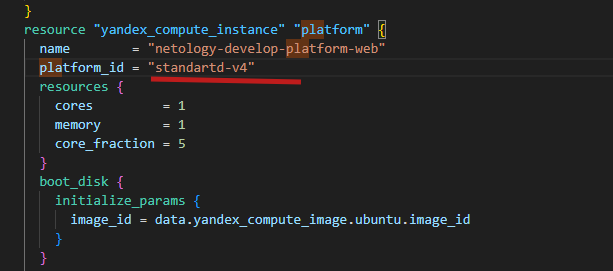


поправили все ошибки 
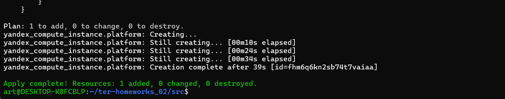

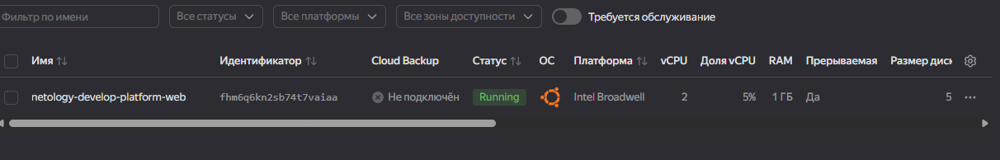


```
terraform console
```
найдем внешний ip и подкючимся 


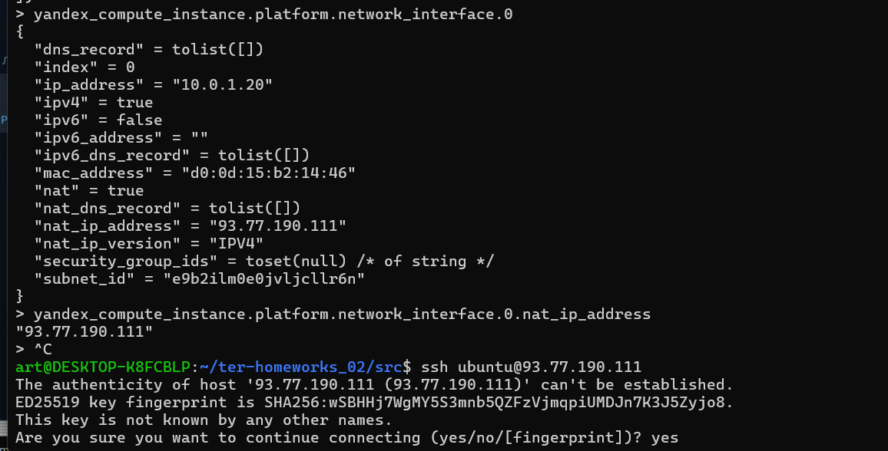


```
 ssh ubuntu@93.77.190.111
```
Подключимся 
```
eval $(ssh-agent) && ssh-add
```

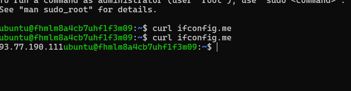


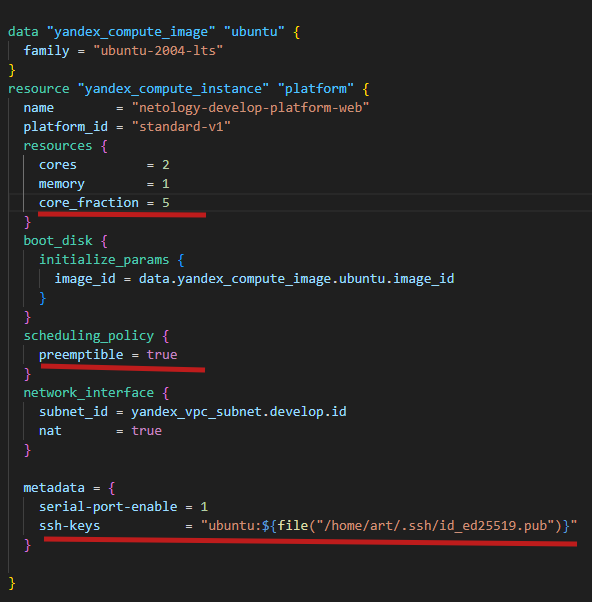

``eemptible = true`` делает ВМ прерываемой. Это значит, что Яндекс.Облако может остановить такую ВМ в любой момент (но не чаще раза в 24 часа). Взамен вы получаете значительную скидку на стоимость.
```core_fraction=5``` — это гарантированная доля производительности vCPU. Значение 5% означает, что ВМ будет получать не менее 5% мощности ядра, но может потреблять и больше, если на физическом хосте есть свободные ресурсы. Это позволяет экономить на ВМ

# Задание 2
## Внесем переменные
```
cp main.tf main.old
```
Добавим переменные в variables.tf
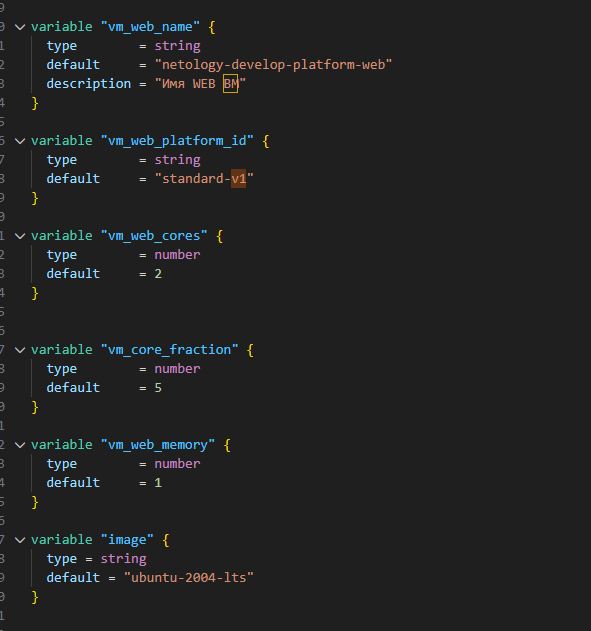

```
 terraform plan
```
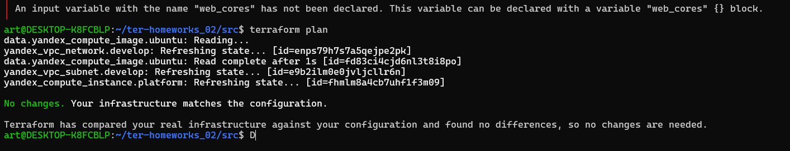

# Задание 3
## Cоздадим файл ``vms_platform.tf``


Перенесем туда преременные из variables и переименуем их 

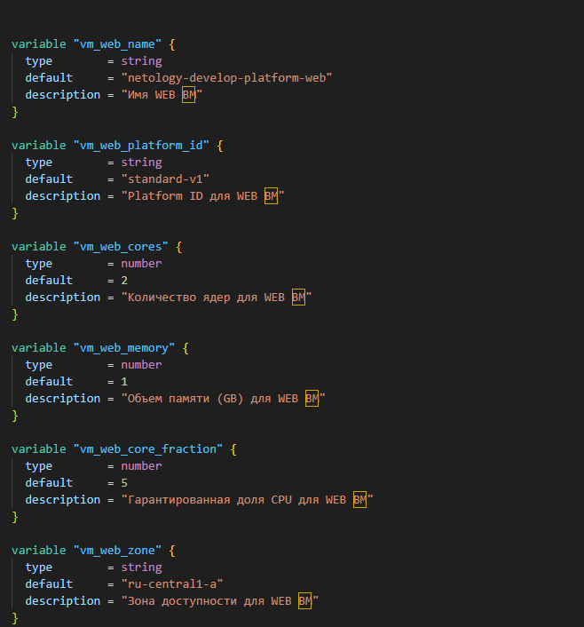


добавим переменные для второй ВМ

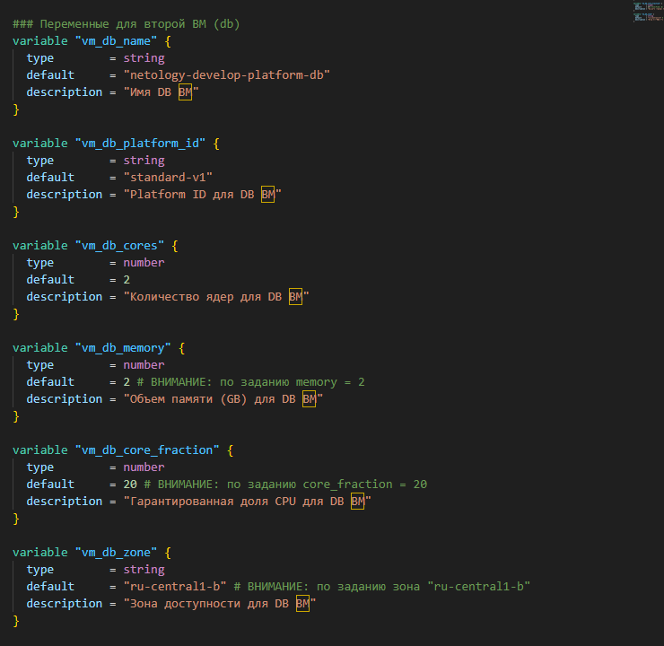


 в ``main.tf ``добавим создание второй ВМ 


```
resource "yandex_compute_instance" "platform_db" {
  name        = var.vm_db_name
  platform_id = var.vm_db_platform_id
  zone        = var.vm_db_zone # Это будет "ru-central1-b"

  resources {
    cores         = var.vm_db_cores         # = 2
    memory        = var.vm_db_memory        # = 2
    core_fraction = var.vm_db_core_fraction # = 20
  }

  boot_disk {
    initialize_params {
      image_id = data.yandex_compute_image.ubuntu.image_id
    }
  }

  scheduling_policy {
    preemptible = true # Для экономии тоже сделаем прерываемой
  }

  network_interface {
    subnet_id = yandex_vpc_subnet.develop.id
    nat       = true
  }

  metadata = {
    serial-port-enable = 1
    ssh-keys           = "ubuntu:${file("/home/art/.ssh/id_ed25519.pub")}"
  }
}
```

# Задание 4
создадим файл ``outputs.tf``

```
output "all_vm_info" {
  value = {
    web = {
      name        = yandex_compute_instance.platform.name
      external_ip = yandex_compute_instance.platform.network_interface.0.nat_ip_address
      fqdn        = yandex_compute_instance.platform.fqdn
    }
    db = {
      name        = yandex_compute_instance.platform_db.name
      external_ip = yandex_compute_instance.platform_db.network_interface.0.nat_ip_address
      fqdn        = yandex_compute_instance.platform_db.fqdn
    }
  }
}

output "web_nat_ip_address" {
  value = yandex_compute_instance.platform.network_interface.0.nat_ip_address
}
output "db_nat_ip_address" {
  value = yandex_compute_instance.platform.network_interface.0.nat_ip_address
}


```

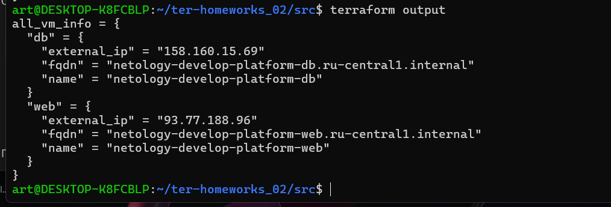


```
 terraform output -raw db_nat_ip_address
```
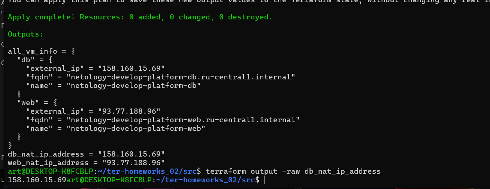

# Задание 5


создадим файл ```locals.tf```
```
locals {
  #locals_vm_web_name = "${var.vm_web_name_prefix}-${var.environment}" # Пример, если есть такие переменные
  # Или более простой вариант, соответствующий заданию:
  locals_vm_web_name = "local-${var.vm_web_name}-platform-web" # Где var.environment_web = "develop"
  locals_vm_db_name  = "local-${var.vm_db_name}-platform-db"   # Где var.environment_db = "develop"

  # Либо просто "склеить" из нескольких частей
  # vm_web_name = "${var.project}-${var.role_web}" и т.д.
}
```

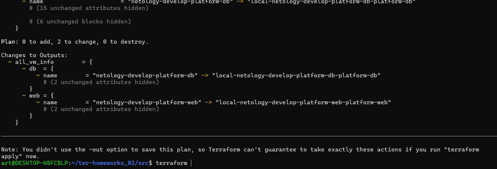

 # Задание 6

 Вместо использования трёх переменных  ".._cores",".._memory",".._core_fraction" в блоке  resources {...}, объедините их в единую map-переменную **vms_resources** и  внутри неё конфиги обеих ВМ в виде вложенного map


 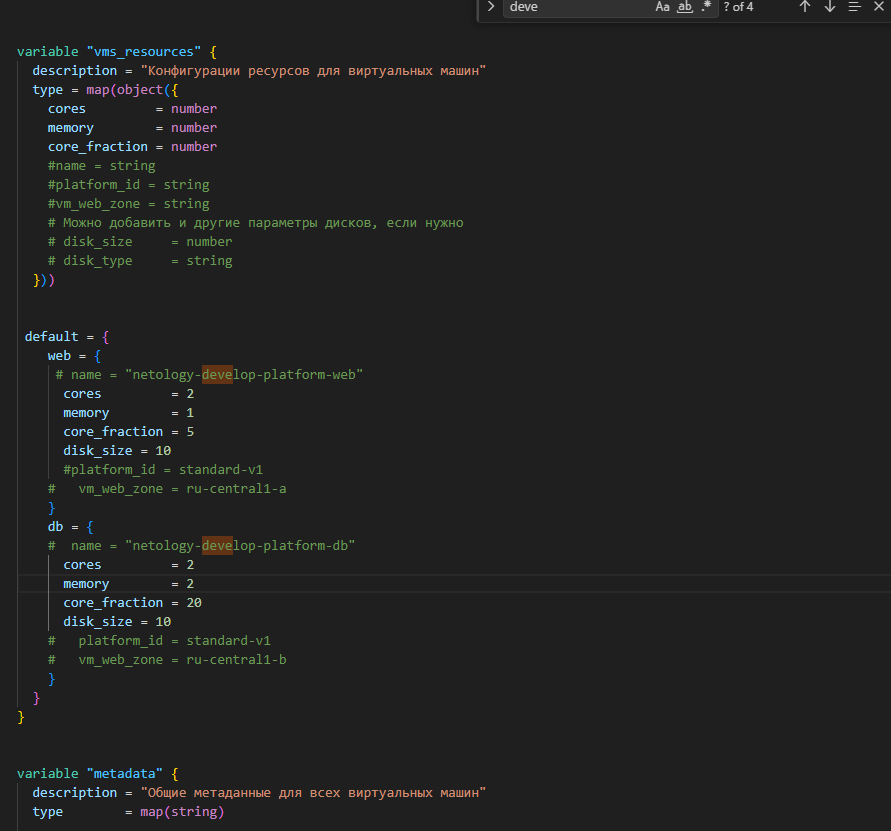


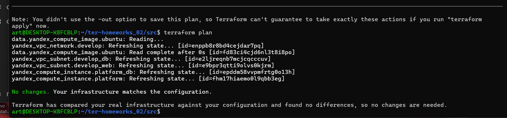

# Задание 7


```
terraform console

```


1. Напишите, какой командой можно отобразить **второй** элемент списка test_list.
```
local.test_list[1]
```
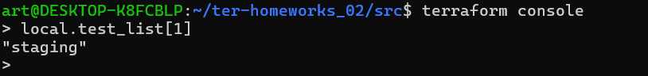

2. Найдите длину списка test_list с помощью функции length(<имя переменной>).
```
length(local.test_list)
```
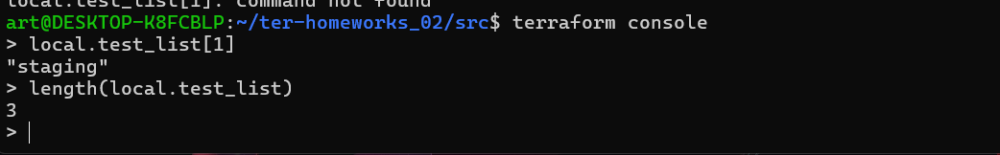

3. Напишите, какой командой можно отобразить значение ключа admin из map test_map.
```
 local.test_map["admin"]
```
или
```
local.test_map.admin
```
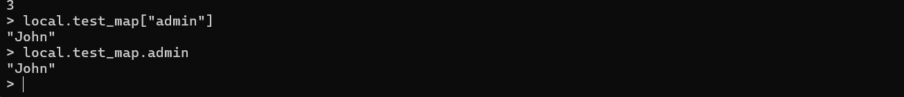


4. Напишите interpolation-выражение, результатом которого будет: "John is admin for production server based on OS ubuntu-20-04 with X vcpu, Y ram and Z virtual disks", используйте данные из переменных test_list, test_map, servers и функцию length() для подстановки значений.


```
"${local.test_map.admin} is  ${keys(local.test_map)[0]} for production server based on OS ${local.servers.production.image} with  ${local.servers.production.cpu} vcpu, ${local.servers.production.ram} ram and ${join(", ",local.servers.production.disks)} virtual disks"
```

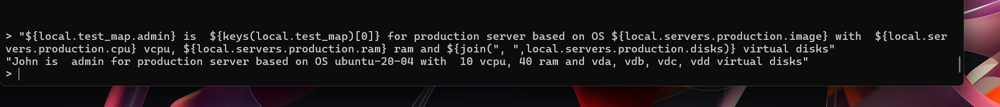

```
 terraform destroy
```

# Задание 8

для извлечения SSH команды для dev1
```
var.test[0]["dev1"][0]

```

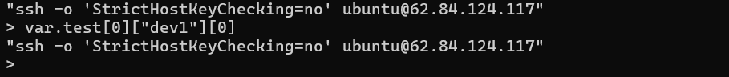
